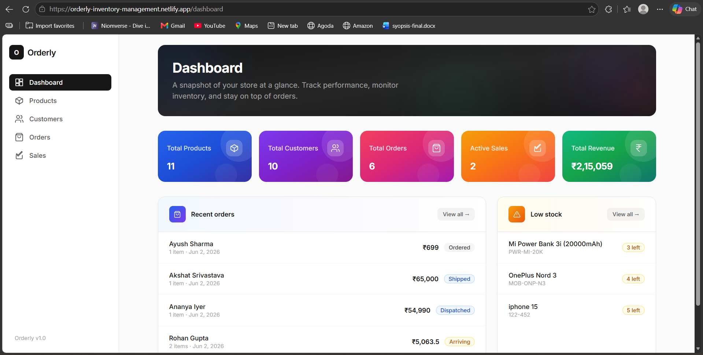
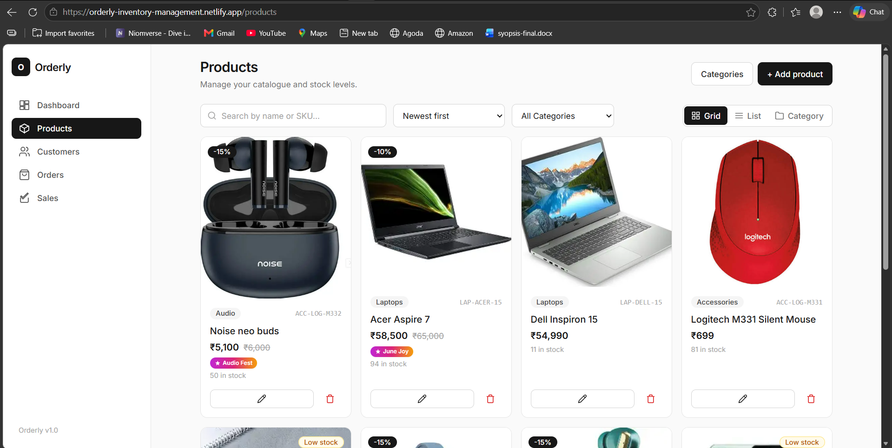
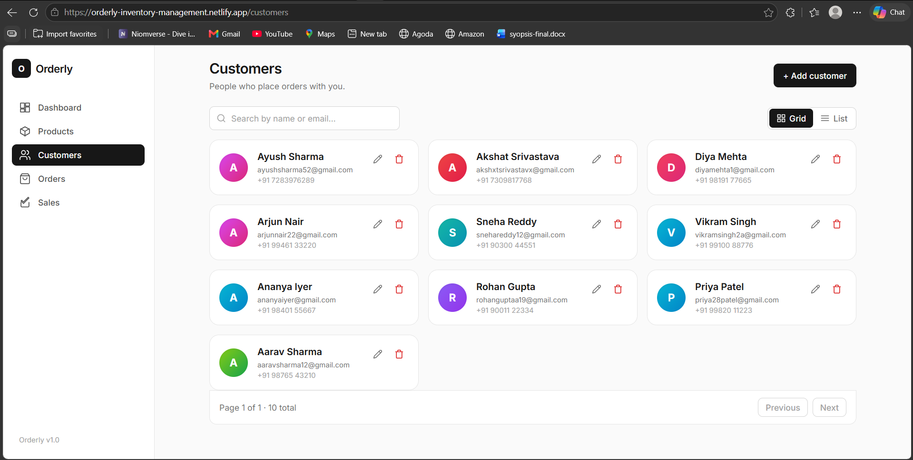
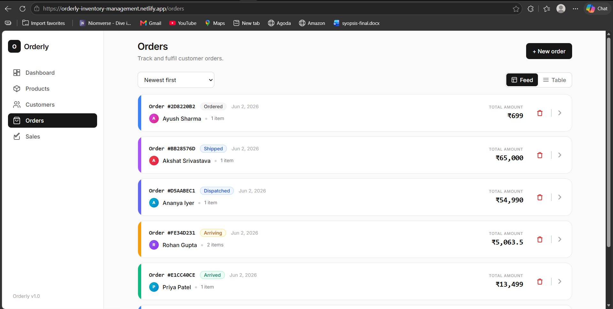
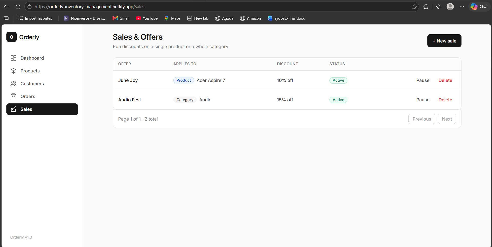

# Orderly — Inventory & Order Management System

A full-stack inventory and order management application for a small retail business. It handles products, customers, and orders end to end: placing an order checks stock, deducts inventory, and calculates the total on the server; deleting an order restores the stock it reserved. It also supports per-product and category-wide discounts, a fulfilment status pipeline, and a live dashboard.

## Live demo

| | URL |
|---|---|
| **Frontend** | https://orderly-inventory-management.netlify.app |
| **Backend API** | https://orderly-api-dcga.onrender.com |
| **API docs (Swagger)** | https://orderly-api-dcga.onrender.com/docs |
| **Docker image** | https://hub.docker.com/r/akshat2064/orderly-backend |

> **A note on hosting:** the backend runs on Render's free tier, which spins down after inactivity. To keep it awake I've layered **three independent keep-alive pingers** — cron-job.org, UptimeRobot, and a GitHub Actions workflow (`.github/workflows/keep-alive.yml`) — each hitting the `/health` endpoint every few minutes. The **first request after a cold start can still take ~50 seconds**; just refresh once and the data loads. And if it *somehow* still buffers after a three-layer keep-alive, then that's simply the universe (and Render's free tier) conspiring to keep me from this job 🥲.

## Features

**Core modules**
- **Products** — create, edit, delete, search, sort, paginate; per-product image (with a graceful coloured-initial fallback), category, price (₹), and stock.
- **Customers** — full CRUD with unique-email enforcement.
- **Orders** — create an order from one or more products; stock is validated and deducted atomically, and the total is calculated by the backend. Each order moves through a status pipeline: `ordered → dispatched → shipped → arriving → arrived`.
- **Dashboard** — totals for products, customers, orders, active sales, and revenue, plus recent orders and a low-stock panel. Stat cards link through to their pages.

**Extras**
- **Sales / offers** — discounts scoped to a single product or a whole category. The best applicable offer wins (no stacking), and the discounted price is snapshotted onto the order at checkout.
- **Categories** — managed in a dedicated table; add or remove categories from the UI.
- **Low-stock view** — the dashboard low-stock panel links to a filtered product list (`?stock=low`).
- Grid / list / category views, search, pagination, sort, skeleton loaders, toasts, and confirmation modals.

## Business rules enforced

- Product SKU is unique; customer email is unique.
- Stock can never go negative (validated in the API and by a database CHECK constraint).
- An order can't be placed if stock is insufficient → `409 INSUFFICIENT_STOCK`.
- Creating an order deducts inventory; deleting an order restores it — both inside a single transaction.
- The order total is always computed server-side from the (possibly discounted) unit prices; the client never sends a price.
- Order status moves forward one step at a time; invalid jumps return `422`.

## Tech stack

**Backend** — Python · FastAPI · SQLAlchemy 2.0 · Alembic · PostgreSQL · Pydantic
**Frontend** — React · Vite · React Query · Axios · React Hook Form · Zod · Tailwind CSS
**Infrastructure** — Docker · Docker Compose · Render (backend) · Netlify (frontend) · Docker Hub

## Architecture

The backend follows a layered design so each concern has one place to live:

```
API (FastAPI routers)      →  request/response, status codes
   ↓
Services                   →  business rules + transaction boundaries
   ↓
Repositories               →  data access (queries, no business logic)
   ↓
Models (SQLAlchemy)        →  tables, constraints, relationships
```

Order creation locks the affected product rows (`SELECT ... FOR UPDATE`) so two concurrent orders can't oversell the same unit. Pydantic schemas validate input at the edge; database CHECK constraints are the final backstop.

## Project structure

```
.
├── backend/
│   ├── app/
│   │   ├── api/            # routers + dependency injection
│   │   ├── services/       # business logic, transactions
│   │   ├── repositories/   # data access
│   │   ├── schemas/        # Pydantic models
│   │   ├── models/         # SQLAlchemy models
│   │   ├── core/           # config, exceptions
│   │   ├── middleware/     # global error handling
│   │   └── main.py
│   ├── alembic/            # database migrations
│   ├── Dockerfile
│   └── requirements.txt
├── frontend/
│   ├── src/
│   │   ├── pages/          # Dashboard, Products, Customers, Orders, Sales
│   │   ├── components/     # reusable UI + feature components
│   │   ├── hooks/          # React Query hooks
│   │   ├── api/            # Axios client + per-resource calls
│   │   ├── services/       # query client, toast store
│   │   └── utils/
│   ├── netlify.toml
│   └── package.json
└── docker-compose.yml
```

## Running locally

**Prerequisites:** Docker Desktop, and Node.js 20+ for the frontend.

### 1. Backend + database (Docker Compose)

```bash
cp .env.example .env          # Windows: copy .env.example .env
docker compose up --build
```

This starts PostgreSQL and the API, runs migrations automatically, and serves the API at **http://localhost:8000** (docs at `/docs`).

Seed some demo data:

```bash
docker compose exec backend python -m app.scripts.seed
```

### 2. Frontend (Vite dev server)

```bash
cd frontend
cp .env.example .env          # Windows: copy .env.example .env
npm install
npm run dev
```

The app runs at **http://localhost:5173** and talks to the backend at `http://localhost:8000/api/v1`.

## Environment variables

**Root `.env`** (used by Docker Compose)

| Variable | Example |
|---|---|
| `POSTGRES_USER` | `orderly` |
| `POSTGRES_PASSWORD` | `orderly` |
| `POSTGRES_DB` | `orderly` |
| `BACKEND_CORS_ORIGINS` | `http://localhost:5173` |

**`frontend/.env`**

| Variable | Example |
|---|---|
| `VITE_API_URL` | `http://localhost:8000/api/v1` |

## API overview

All endpoints are under `/api/v1`. Full interactive docs at `/docs`.

| Resource | Endpoints |
|---|---|
| Products | `GET/POST /products` · `GET/PUT/DELETE /products/{id}` (supports `search`, `category`, `low_stock`, `sort_by`, `page`, `limit`) |
| Customers | `GET/POST /customers` · `GET/PUT/DELETE /customers/{id}` |
| Orders | `GET/POST /orders` · `GET /orders/{id}` · `PATCH /orders/{id}/status` · `DELETE /orders/{id}` |
| Sales | `GET/POST /sales` · `PATCH/DELETE /sales/{id}` |
| Categories | `GET/POST /categories` · `DELETE /categories/{name}` |
| Dashboard | `GET /dashboard` |

## Database & migrations

Schema changes are managed with Alembic. Migrations run automatically when the backend container starts (`alembic upgrade head`). To create a new migration after changing a model:

```bash
docker compose exec backend alembic revision --autogenerate -m "describe change"
docker compose exec backend alembic upgrade head
```

## Deployment

- **Backend** is deployed on Render from `backend/Dockerfile` with a managed PostgreSQL instance. Migrations run on boot. The `BACKEND_CORS_ORIGINS` environment variable is set to the Netlify URL.
- **Frontend** is deployed on Netlify (base directory `frontend`, `npm run build`, publish `dist`). `VITE_API_URL` points at the Render API. A `_redirects` rule serves `index.html` for client-side routing.
- The Docker image is published to Docker Hub: `docker build -t akshat2064/orderly-backend ./backend && docker push akshat2064/orderly-backend`.
- The backend stays warm via a three-layer keep-alive (cron-job.org, UptimeRobot, and a GitHub Actions workflow).

## Screenshots

### Dashboard


### Products


### Customers


### Orders


### Sales & Offers


## Possible improvements

- Authentication and per-user roles (admin vs. staff).
- Order cancellation as a distinct status with audit history.
- CSV export and bulk import for products.
- Server-side pagination cursors for very large catalogues.
- Unit/integration test suite and CI.
